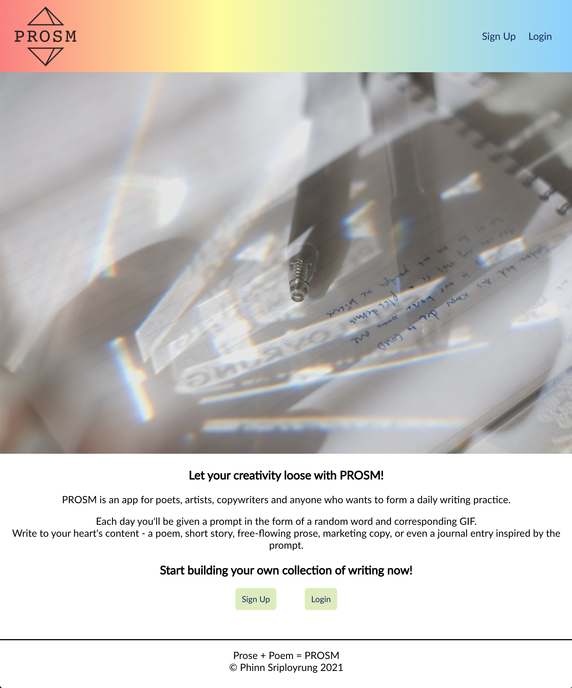

<!-- ABOUT THE PROJECT -->

## About The Project

  

PROSM is an app meant to be used by writers and creatives as a daily creative writing tool. The app gives users a random prompt with an accompanying gif to help with getting their creative juices flowing. Posts are added to the user's Collection and can be edited or deleted.

[Check out the live app here.](https://prosm-app.vercel.app/)

### Built With

- [HTML](https://developer.mozilla.org/en-US/docs/Web/HTML)
- [CSS](https://developer.mozilla.org/en-US/docs/Web/CSS)
- [JavaScript](https://www.javascript.com/)
- [React](https://reactjs.org/docs/getting-started.html)
- [Node.js](https://nodejs.org/en/docs/)
- [Express](https://expressjs.com/)
- [PostgreSQL](https://www.postgresql.org/)
- [Knex](http://knexjs.org/)

<!-- SCREEN SHOTS -->

## Screen Shots

### Homepage desktop view

### Sign up page mobile view

### Login page mobile view

### Daily Prompt page desktop view

### User Collection page desktop view

## Roadmap

See the [open issues](https://github.com/sriphinn/prosm/issues) for a list of proposed features (and known issues).

## Contact

psrip001@gmail.com

Portfolio: https://phinn.dev

Project Link: [https://github.com/sriphinn/prosm](https://github.com/sriphinn/prosm)

Project API Link: [https://github.com/sriphinn/prosm-api](https://github.com/sriphinn/prosm-api)